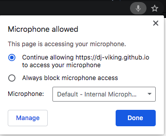

# FFT Audio Visualizer

### Powered By 
  

## Description 

An audio visualizer built into the browser canvas. Takes audio input from external microphone or an internal digital audio buss.

## Table of Contents
* [Usage](#Usage)
* [Deployed](#Deployed)
* [Credits](#Credits)
* [License](#License)
* [Questions](#Questions)

## Usage

* Currently this works the best inside google chrome's browser. It somehow has better rendering capabilities than firefox at this time.

1. Allow the browser to access your microphone or audio input device.
---
* 
---
2. Navigate to your:
* Browsers settings-> privacy and security settings->
* Site settings->Permissions->Microphone
  - Or if you click the little microphone at the right of your URL bar you can access this menu a lot easier by clicking the ***Manage*** button
---
* 
---

3. Change to your desired audio input device.
---
* 
---

## Deployed

* 👇Click the badge to see the deployed web application!
* 

## Credits

* Anders Ackerman
* Coding Train Youtube channel for helping me discover this part of p5.js library!

## License

FFT Audio Visualizer is licensed under the MIT license.

## Questions

If anybody has any questions please reach out to the creator of the project - Anders Ackerman via:
* Email: anders.swedishviking@gmail.com
* GitHub: (https://github.com/dj-viking)
